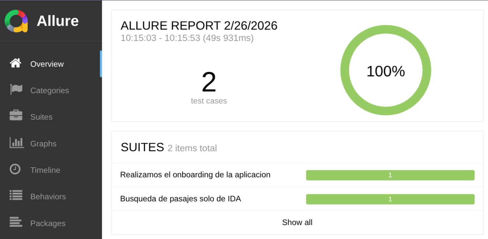
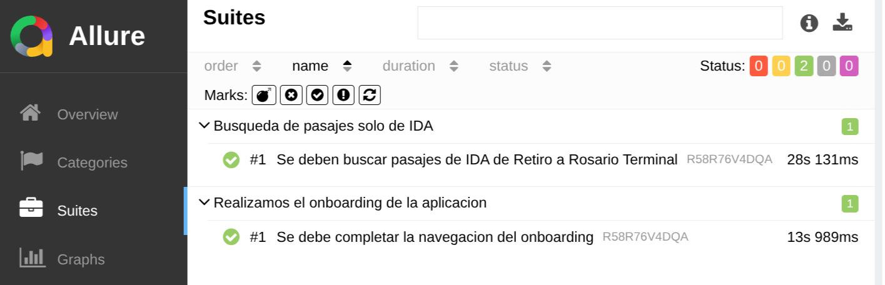

# 📱 CDP Challenge Mobile Automation

Este proyecto es un framework de automatización para aplicaciones móviles Android utilizando **WebdriverIO** y **TypeScript**.
Realice la automtatización de la aplicación de Central de Pasajes para Android, porque la sample app de BrowserStack me presento varios inconvenientes.
Realice dos flujos de pruebas, dos happy paths:
- Un flujo de onboarding
- Un flujo de búsqueda de pasajes de ida

## 🚀 Tecnologías Utilizadas

- **WebdriverIO**: Motor de automatización.
- **TypeScript**: Lenguaje de programación.
- **Appium**: Para la interacción con dispositivos móviles nativos.
- **Allure Reporter**: Generación de reportes detallados.
- **BrowserStack**: Ejecución en la nube.

## 🎯 Justificación de las decisiones técnicas

- **TypeScript**: Elegí TypeScript por sobre JavaScript para añadir tipado estático, lo que mejora la legibilidad del código, según mi perspectiva.
- **Page Object Model**: Elegí POM para estructurar el código, lo que facilita el mantenimiento, legibilidad y reusabilidad del código, tanto así como su escalabilidad. Por eso también implementé las clases de los Locators.
- **Helpers**: Implementé helpers con el método SafeClick porque en mobile tienden a fallar más las interacciones. Se puede mejorar haciendo un extend desde la clase base y poniendo los métodos allí.
- **Test Specs**: Use Test Specs para definir los escenarios de prueba, porque es más rápido, al igual que en challenge web, de mi preferencia usaría BDD con Cucumber y las clases test steps.
- **Reporte**: En este caso uso los reportes de Allure porque hay una librería específica para WDIO que ya está integrada.


## 🎬 Escenarios de Prueba

Actualmente el proyecto cuenta con los siguientes escenarios automatizados, diseñados para ser robustos ante cambios en la interfaz:

### 1. Flujo de Onboarding (End-to-End)
- **Archivo**: `test/specs/onboarding.test.ts`
- **Objetivo**: Asegurar que un usuario nuevo puede navegar las pantallas de bienvenida y llegar al buscador.
- **Detalle de Pasos**:
    1. **Detección de Pop-up**: El sistema espera hasta 20 segundos por un pop-up promocional. Si aparece, lo cierra de forma segura; si no, continúa sin fallar (manejo de elementos opcionales).
    2. **Carrusel Informativo**: Se valida la presencia de los títulos en cada slide ("BUSCÁ TU PASAJE", "ELEGÍ CÓMO VIAJAR", etc.).
    3. **Navegación**: Se interactúa con el botón "Continuar" en cada pantalla.
    4. **Remind Later**: Se gestiona el diálogo de notificaciones mediante el método `waitQuizasMasTarde`, configurado como opcional para evitar bloqueos.
    5. **Verificación**: Se confirma la carga del buscador principal verificando un elemento único del Home.

### 2. Búsqueda de Pasajes de Ida
- **Archivo**: `test/specs/tickets.test.ts`
- **Objetivo**: Validar el funcionamiento del motor de búsqueda desde la selección de origen hasta la pantalla de resultados.
- **Detalle de Pasos**:
    1. **Bypass de Onboarding**: Utiliza el helper `skipOnboarding()` para agilizar el inicio del test (reutilización de código).
    2. **Selección de Origen**: Ingresa al buscador de ciudades, escribe "Buenos Aires" y selecciona la primera coincidencia.
    3. **Selección de Destino**: Repite el proceso para "Rosario".
    4. **Calendario Nativo**: Interactúa con el componente de fecha nativo de Android, selecciona el día actual y confirma.
    5. **Ejecución**: Presiona el botón "BUSCAR PASAJES" usando el helper `safeClick` para garantizar que el elemento sea interactuable.
    6. **Aserción Final**: Valida que la app navega a la pantalla de selección de servicios mediante la comprobación del título "Elegí tu viaje de IDA".


## 📋 Requisitos Previos

- **Node.js** (v18 o superior).
- **Appium Server** instalado (`npm install -g appium`).
- **UiAutomator2 Driver** (`appium driver install uiautomator2`).
- Un dispositivo Android conectado o un emulador activo (para pruebas locales).
- Credenciales de **BrowserStack** (para pruebas en la nube).

## 🛠️ Instalación

1.  Clonar el repositorio.
2.  Instalar dependencias:
    ```bash
    npm install
    ```
3.  Configurar el archivo `.env` con tus credenciales de BrowserStack (si aplica):
    ```env
    BROWSERSTACK_USERNAME=tu_usuario
    BROWSERSTACK_ACCESS_KEY=tu_clave
    ```

## 🏃 Ejecución de Pruebas

El proyecto está configurado para ejecutarse en diferentes entornos mediante la variable de entorno `EXECUTION`.

### Ejecución Local
Usa este comando para correr las pruebas en tu dispositivo físico o emulador:
```bash
npm run wdio:local
```

### Ejecución en BrowserStack
Usa este comando para correr las pruebas en la nube:
```bash
npm run wdio:bs
```

### Ejecución de un Test Específico
Para ejecutar un solo archivo de pruebas (ej: onboarding):
```bash
npm run wdio:local -- --spec ./test/specs/onboarding.test.ts
```

## 📊 Reportes

Los reportes se generan automáticamente con Allure. Para visualizar los resultados de la última ejecución:

```bash
npm run report
```
*Este comando limpia los resultados previos, genera el reporte y lo abre en tu navegador.*

### Overview



### Suites



### 🎥 Visualización de Reportes
Puedes acceder a los reportes históricos en el siguiente enlace:
[https://aleame.github.io/CDP-Challenge-Mobile/](https://aleame.github.io/CDP-Challenge-Mobile/)


https://github.com/user-attachments/assets/c3310dc9-871b-4171-be8b-54918a7d044d


https://github.com/user-attachments/assets/8e5880eb-c595-4e88-95c0-576bd30c0406

## 🚀 CI/CD con GitHub Actions

El proyecto cuenta con un pipeline automatizado que:

1.  Se ejecuta ante cualquier `push` a la rama `main`.
2.  Lanza las pruebas automáticamente en **BrowserStack**.
3.  Publica los reportes de **Allure** en **GitHub Pages**.

### Configuración de Secretos
Para que el pipeline funcione, asegúrate de tener configurados los siguientes **Secrets** en GitHub:
- `BROWSERSTACK_USERNAME`
- `BROWSERSTACK_ACCESS_KEY`


## 📁 Estructura del Proyecto

```text
.
├── resources/              # Contiene el APK de la aplicación y documentación adicional.
├── test/
│   ├── Helpers/           # Funciones de ayuda (SafeClick, manejo de teclado, contextos).
│   ├── Locators/          # Definición de selectores (ID, XPath, etc.) separados por página.
│   ├── Pages/             # Implementación del Page Object Model (Lógica de las páginas).
│   └── specs/             # Definición de los casos de prueba (Suites).
├── wdio.conf.ts           # Archivo central de configuración de WebDriverIO.
├── package.json           # Definición de scripts, comandos y dependencias del proyecto.
└── README.md              # Documentación principal del proyecto.
```

- **`test/Locators/`**: Aquí se centralizan todos los selectores. Esto facilita el mantenimiento si un ID cambia en la app.
- **`test/Pages/`**: Contiene las clases que heredan de `BasePage`, donde se definen los métodos de interacción con los elementos usando los locators.
- **`test/Helpers/`**: Incluye `mobile.helpers.ts` con métodos robustos para clicks y swipes, reduciendo la flakyness de los tests.
- **`test/specs/`**: Es donde viven los archivos `.test.ts`. Cada archivo representa una suite de pruebas funcional.
- **`resources/`**: Carpeta para guardar binarios (APKs) y otros recursos estáticos.

---
© 2026 CDP Challenge Mobile Automation
